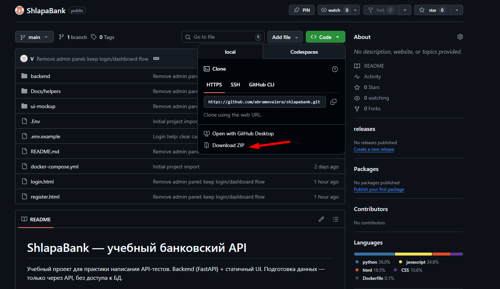
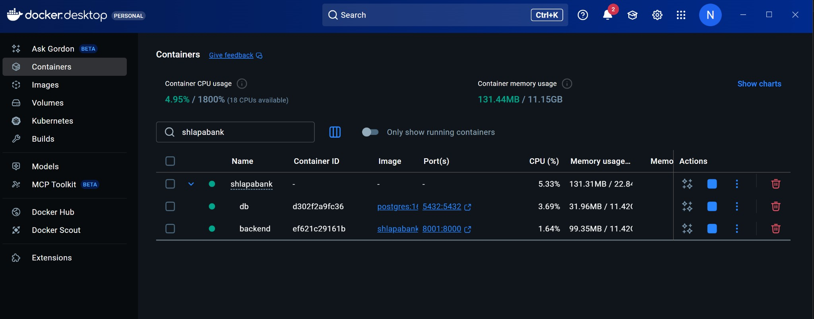
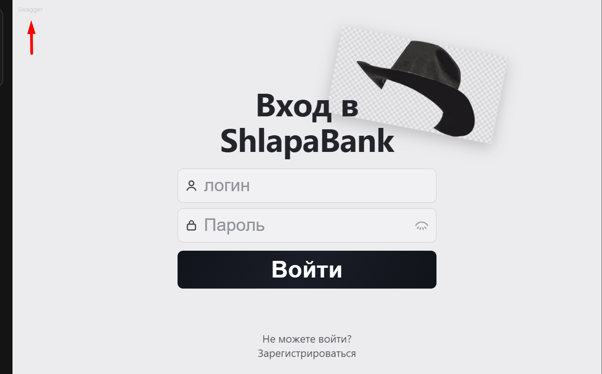
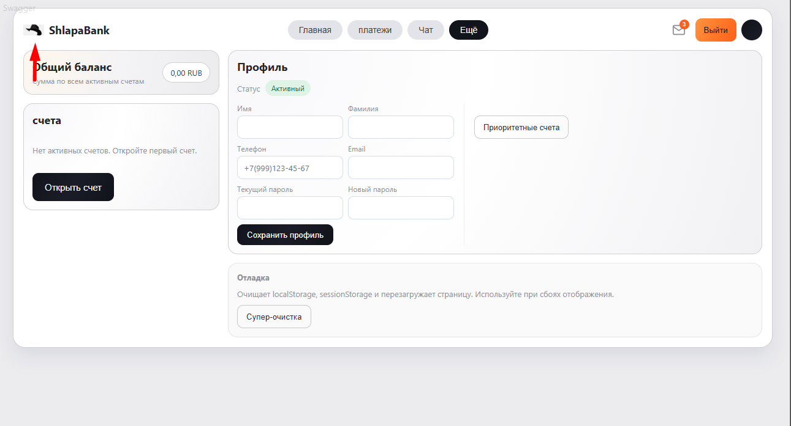

# ShlapaBank — учебный банковский API

Учебный проект для практики написания API и UI тестов.

---

## Запуск

**1)** Скачайте проект к себе в удобную папку. На GitHub нажмите зелёную кнопку «Code» и выберите **Download ZIP**. Обязательно распакуйте архив — проект должен лежать в обычной папке, а не в ZIP.



**2)** Скачайте и установите [Docker](https://www.docker.com/get-started) и зарегистрируйтесь (нужен аккаунт для скачивания образов).

**3)** Поднимите контейнеры из папки проекта. Откройте обычный терминал (CMD или PowerShell), перейдите в папку с распакованным проектом командой `cd <путь к папке>` (например, `cd C:\Users\Имя\Downloads\shlapabank-main`), затем выполните:

```powershell
docker compose up --build
```

Запущенный проект в Docker Desktop выглядит так (контейнеры **shlapabank**, **backend**, **db** в статусе Running):



После запуска откройте в браузере главную страницу интерфейса банка:

- **Главная страница (UI):** http://localhost:8001/ или http://localhost:8001/login  

**Важно:** все ручки (кроме `/health`, `/auth/register`, `/auth/login`) требуют заголовка `Authorization: Bearer <token>`. Токен получают через `POST /auth/login`.

---

## Для удобства

Swagger доступен прямо в интерфейсе банка — клик по «Swagger» в левом верхнем углу.

**Страница входа:** «Не можете войти?» — открывает окно «Очистить кеш? Да/Нет» для сброса localStorage и sessionStorage (при проблемах с токеном).



**Читерская шляпа:** в левом верхнем углу — логотип-шляпа. Клик по нему открывает окно быстрого изменения баланса своих счетов: пополнение, списание или обнуление без OTP и без создания транзакций. Удобно для подготовки сценариев и тестовых данных (ручки — в блоке Helper).



---

## Блок 1. Health

### Требования к функционалу

Проверка доступности сервиса: публичная ручка без авторизации. Используется для smoke-тестов и мониторинга. Ограничений нет.

### Ошибки

Ошибок не возвращает (при доступности сервиса всегда 200).

---

## Блок 2. Helper

### Требования к функционалу

Вспомогательный функционал для подготовки данных в тестах: получение OTP и изменение баланса своих счетов без OTP и без создания транзакций. В UI доступен по клику по логотипу.

- **Авторизация:** токен в заголовке. Пользователь должен быть активен.
- **Область действия:** только свои активные счета.
- **OTP (одноразовый код подтверждения):** получается через Helper (`otp/preview`). Код из 4 цифр, действует 1 минуту, привязан к пользователю. Там, где в API требуется подтверждение операции (пополнение, переводы, платежи), передача этого кода обязательна.
- **Изменение баланса:** транзакции не создаются. Для «настоящего» пополнения с созданием транзакции используется ручка пополнения счёта (блок Счета).

### Ошибки

| Код | detail | Когда |
|-----|--------|-------|
| 404 | `account_not_found` | Счёт не найден или не свой |
| 400 | `account_inactive` | Счёт закрыт |
| 400 | `insufficient_funds` | Недостаточно средств |

---

## Блок 3. Админ (Admin)

### Требования к функционалу

Управление пользователями и счетами от имени администратора: список пользователей, блокировка/разблокировка, удаление (для очистки тестовых данных), просмотр и пополнение счетов, просмотр транзакций, настройка банков для перевода по телефону. Нужен для подготовки данных в тестах.

- **Авторизация:** токен пользователя с ролью администратор (`ADMIN`). Админ по умолчанию: логин `admin`, пароль `admin` (если не задано в `.env`). Админ выполняет операции без OTP.
- **Ограничения:** доступ только у роли администратор; обычный клиент получает 403 (доступ запрещён). Админа по умолчанию удалить нельзя. Банки для перевода по телефону: 0–5 внешних банков на пользователя; наш банк в список не включается. Коды банков берутся из проверки перевода по телефону (кроме «Наш банк»).

### Ошибки

| Код | detail | Когда |
|-----|--------|-------|
| 404 | `not_found` | Пользователь не найден |
| 404 | `account_not_found` | Счёт не найден |
| 400 | `amount_must_be_positive` | Сумма ≤ 0 |
| 400 | `invalid_bank_codes: ...` | Указан наш банк или несуществующий |
| 400 | `max_5_banks_allowed` | Больше 5 банков |
| 400 | `cannot_delete_admin` | Попытка удалить дефолтного админа |

---

## Блок 4. Авторизация и регистрация (Auth)

### Требования к функционалу

Регистрация — создание нового пользователя по логину и паролю. Логин: 6–20 символов, только латиница (A–Z, a–z) и цифры (0–9); без пробелов, кириллицы и спецсимволов (_, -, @ и т.д.). Пароль: 8–30 символов, минимум 1 строчная, 1 заглавная, 1 цифра, 1 спецсимвол, без пробелов, не должен совпадать с логином. Логин уникален в системе; повторная регистрация с тем же логином → 409. При регистрации пользователю назначается случайный набор 0–5 внешних банков для переводов по телефону (блок Переводы).

Вход (логин) — проверка логина и пароля, выдача токена доступа (JWT) для вызова защищённых ручек. Логин при входе: 1–20 символов, пароль: 1–100 символов. После 5 неудачных попыток пользователь блокируется (дальнейший логин → 403 `user_blocked`); при успешном входе счётчик сбрасывается.

### Ошибки

| Код | detail | Когда |
|-----|--------|-------|
| 401 | `invalid_credentials` | Неверный логин или пароль |
| 403 | `user_blocked` | Пользователь заблокирован |
| 409 | `validation_error: login_not_unique` | Логин уже занят |
| 400 | `validation_error: password_equals_login` | Пароль совпадает с логином |
| 400 | `validation_error: weak_password` | Пароль не соответствует правилам |
| 400 | `validation_error: password_contains_space` | В пароле есть пробел |
| 422 | — | Ошибка валидации Pydantic (длина, формат, обязательные поля). Тело ответа содержит `detail` с описанием. |

---

## Блок 5. Аутентификация (JWT)

### Требования к функционалу

Большинство ручек требуют авторизации. Токен доступа выдаётся при успешном входе и передаётся в заголовке `Authorization: Bearer <токен>`.

- **Срок жизни токена:** по умолчанию 60 минут (настраивается через `ACCESS_TOKEN_EXPIRE_MINUTES`).
- **Защищённые ручки:** все, кроме `/health`, `/auth/register`, `/auth/login`. В Swagger помечены замком; для вызова нужно «Authorize» и ввести `Bearer <token>`.
- **Истёкший или невалидный токен** → 401 `invalid_token`.
- **Заблокированный пользователь** → 403 `user_blocked` даже при валидном токене.

### Ошибки

| Код | detail | Когда |
|-----|--------|-------|
| 401 | `invalid_token` | Токен истёк или невалиден |
| 403 | `user_blocked` | Пользователь заблокирован |

---

## Блок 6. Профиль (Profile)

### Требования к функционалу

Просмотр и обновление данных текущего пользователя: имя, фамилия, телефон, email, смена пароля. Нужен токен в заголовке и активный (не заблокированный) пользователь.

**Обновление профиля (PUT):** принимается частичный JSON — только нужные поля.

- **Имя, фамилия:** только буквы (латиница и кириллица), 1–100 символов. Необязательно.
- **Телефон:** формат `+7XXXXXXXXXX` (10 цифр после +7). Необязательно.
- **Email:** корректный адрес почты. Необязательно.
- **Смена пароля:** обязательно указать и текущий пароль, и новый. Правила для нового пароля — как при регистрации. Новый пароль не должен совпадать с текущим.

Телефон и email уникальны в системе. При совпадении с другим пользователем → 409.

### Ошибки

| Код | detail | Когда |
|-----|--------|-------|
| 409 | `validation_error: phone_not_unique` | Телефон уже используется |
| 409 | `validation_error: email_not_unique` | Email уже используется |
| 400 | `validation_error: password_change_requires_both_fields` | Указан только current или только new password |
| 401 | `invalid_current_password` | Неверный текущий пароль |
| 400 | `validation_error: password_reuse_not_allowed` | Новый пароль совпадает с текущим |

---

## Блок 7. Счета (Accounts)

### Требования к функционалу

Управление банковскими счетами пользователя: список активных счетов, создание, закрытие, пополнение. Для пополнения через API нужен обязательный OTP (одноразовый код, живёт 1 минуту — см. блок Helper); в интерфейсе пополнение возможно через админа или Helper (блоки 2, 3).

- **Авторизация:** токен в заголовке. Пользователь активен.
- **Создание счёта:** выбирается тип счёта и валюта. Типы: **расчётный (DEBIT)** — с него можно переводить, платить и пополнять; **накопительный (SAVINGS)** — только пополнение и хранение, переводить с него нельзя. Валюты: рубли (RUB), доллары (USD), евро (EUR), юани (CNY). Номер счёта выдаётся автоматически (по маске валюты: 2202… для рубля, 3202… для доллара и т.д.).
- **Лимиты:** до 3 счетов в рублях; до 3 счетов в сумме в долларах/евро/юанях.
- **Закрытие счёта:** только при нулевом балансе.
- **Пополнение:** положительная сумма и обязательный OTP (код из 4 цифр, действует 1 минуту, получается в блоке Helper).

### Ошибки

| Код | detail | Когда |
|-----|--------|-------|
| 400 | `account_limit_exceeded` | Превышен лимит счетов по валюте |
| 404 | `not_found` | Счёт не найден или не принадлежит пользователю |
| 400 | `account_already_closed` | Счёт уже закрыт |
| 400 | `account_close_requires_zero_balance` | Закрытие при ненулевом балансе |
| 400 | `invalid_otp_code` | Неверный OTP |
| 400 | `amount_must_be_positive` | Сумма ≤ 0 |
| 404 | `account_not_found` | Счёт не найден при пополнении |

---

## Блок 8. Переводы (Transfers)

### Требования к функционалу

Переводы между счетами (своими по ID, по номеру счёта, по телефону) и обмен валют между своими счетами. Для каждой операции обязателен OTP: одноразовый код из 4 цифр, действует 1 минуту, получается в блоке Helper. Без верного OTP операция не выполняется.

- **Авторизация:** токен в заголовке. Пользователь активен.
- **Счёт списания:** только расчётный (DEBIT), активный. С накопительного (SAVINGS) переводить нельзя.
- **Лимиты:** разовая операция 10–300 000 (в единицах валюты). Суточный лимит — отдельно по каждой валюте на пользователя: рубли 1 000 000, доллары 10 000, евро 9 500, юани 70 000. Лимит считается по переводам и обмену валют; платежи (мобильная связь, поставщики) в лимит не входят. Остаток лимита можно проверить отдельной ручкой.
- **Курсы к рублю:** фиксированы (рубль=1, доллар≈95, евро≈105, юань≈13.5).
- **Перевод между своими счетами:** только в одной валюте. Обмен валют — только между счетами в разных валютах.
- **Перевод по номеру счёта:** указывается номер счёта получателя.
- **Перевод по телефону:** получатель в нашем банке ищется по номеру телефона из профиля (номер должен быть указан в профиле). Зачисление — на его расчётный счёт в той же валюте. Во внешний банк — списание без зачисления (симуляция). У каждого получателя 0–5 внешних банков; при регистрации назначается случайный набор; наш банк в список не входит. Список банков может изменить админ (блок Админ).

### Ошибки

| Код | detail | Когда |
|-----|--------|-------|
| 400 | `invalid_otp_code` | Неверный OTP |
| 400 | `transfer_same_account` | Откуда и куда — один счёт |
| 400 | `transfer_amount_too_small` | Сумма < 10 |
| 400 | `transfer_amount_exceeds_single_limit` | Сумма > 300 000 |
| 400 | `transfer_amount_exceeds_daily_limit` | Превышен суточный лимит |
| 404 | `account_not_found` | Счёт не найден |
| 403 | `forbidden_account_access` | Нет доступа к счёту |
| 400 | `account_inactive` | Счёт неактивен |
| 400 | `transfer_not_allowed_from_savings` | Списание с накопительного счёта |
| 400 | `currency_mismatch` | Разные валюты (или одинаковые при обмене) |
| 400 | `insufficient_funds` | Недостаточно средств |
| 404 | `recipient_not_found_in_our_bank` | Получатель по телефону не найден |
| 400 | `recipient_has_no_suitable_account` | Нет подходящего расчётного счёта у получателя |
| 400 | `currency_not_supported_for_exchange` | Неподдерживаемая пара валют |

---

## Блок 9. Платежи (Payments)

### Требования к функционалу

Оплата мобильной связи и услуг поставщиков (ЖКХ, интернет, образование, благотворительность). Все платежи — только с рублёвого активного счёта. Для операции обязателен OTP: одноразовый код из 4 цифр, действует 1 минуту, получается в блоке Helper.

- **Авторизация:** токен в заголовке. Пользователь активен.
- **Мобильная связь:** оператор — из справочника; телефон в формате `+7XXXXXXXXXX`; сумма 100–12 000 ₽.
- **Поставщики (одна ручка для всех категорий):** поставщик — из справочника (указаны название и нужная длина лицевого счёта); лицевой счёт — только цифры, длина по провайдеру (10–22 символа); сумма 100–500 000 ₽.

### Ошибки

| Код | detail | Когда |
|-----|--------|-------|
| 400 | `invalid_otp_code` | Неверный OTP |
| 400 | `payment_operator_not_supported` | Оператор не из справочника |
| 400 | `payment_provider_not_supported` | Поставщик не из справочника |
| 400 | `payment_amount_out_of_range` | Сумма вне диапазона |
| 400 | `payment_requires_rub_account` | Счёт не в рублях |
| 400 | `payment_account_number_invalid_length` | Неверная длина лицевого счёта |
| 404 | `account_not_found` | Счёт не найден |
| 400 | `insufficient_funds` | Недостаточно средств |

---

## Блок 10. Транзакции (Transactions)

### Требования к функционалу

История финансовых операций пользователя. Возвращаются только транзакции, которые инициировал пользователь или которые затрагивают его счета. Сортировка по дате (сначала новые). Нужен токен в заголовке и активный пользователь. Удобно для проверки, что после пополнения, перевода или платежа появилась нужная запись.

**Типы транзакций:** пополнение (TOPUP), перевод (TRANSFER), платёж (PAYMENT). В поле описания могут быть значения вроде: зачисление админом, пополнение своим OTP, перевод между счетами, перевод по счёту, перевод по телефону, внешний перевод по телефону, обмен валют, мобильная связь, поставщик и т.п.

### Ошибки

Стандартные при отсутствии/невалидности токена или блокировке пользователя (401/403). Специфичных кодов ошибок для списка транзакций нет.

