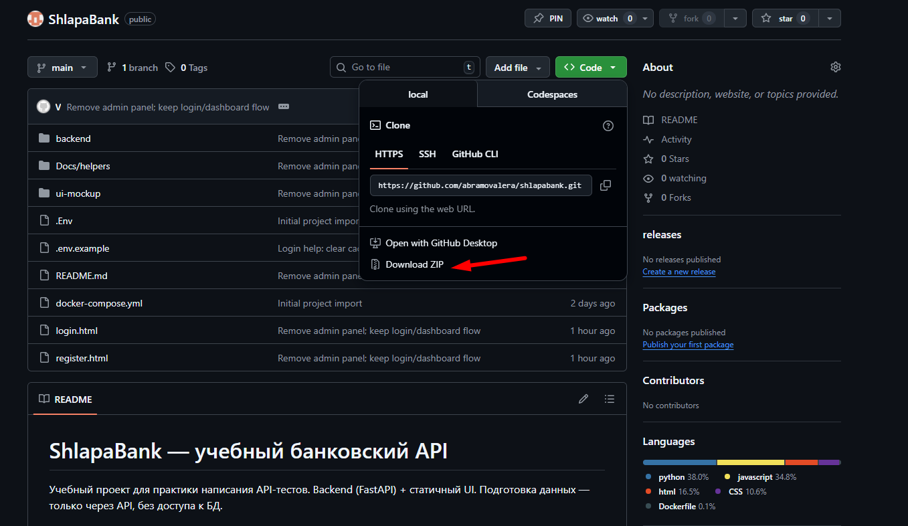
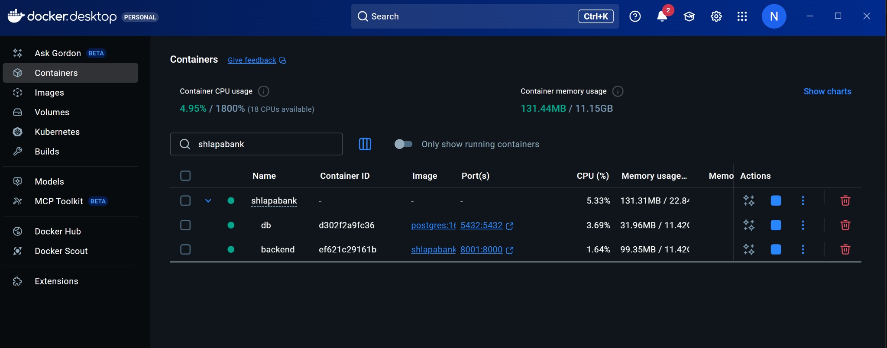
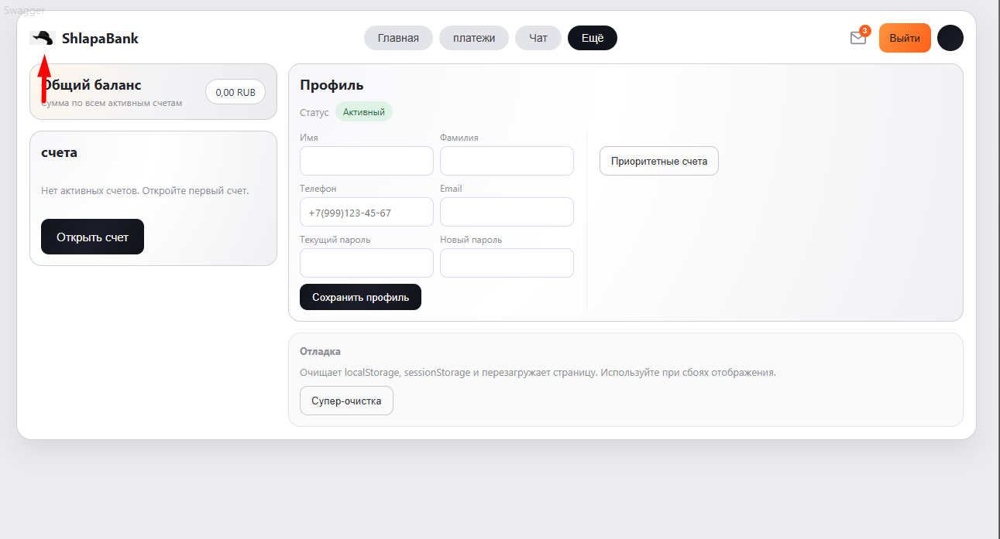

# ShlapaBank — учебный банковский проект

Учебный проект для практики написания API и UI тестов. В каждом блоке сначала **бизнес-требования** (логика для пользователя и интерфейса), затем технический блок **API** (эндпоинты, схемы, серверная валидация), затем **коды ошибок API** в поле `detail` (при 422 возможен массив ошибок полей или строка `validation_error: ...`). Блоки **1–3** — во **вспомогательном** разделе в том же формате.

## Оглавление

- [1. Подготовка](#1-подготовка)
- [2. Требования](#2-требования)
  - [Блок 4. Регистрация и вход (Auth)](#блок-4-регистрация-и-вход-auth)
  - [Блок 5. Сессия пользователя](#блок-5-сессия-пользователя)
  - [Блок 6. Профиль пользователя (Profile)](#блок-6-профиль-пользователя-profile)
  - [Блок 7. Счета (Accounts)](#блок-7-счета-accounts)
  - [Блок 8. Переводы (Transfers)](#блок-8-переводы-transfers)
  - [Блок 9. Платежи (Payments)](#блок-9-платежи-payments)
  - [Блок 10. Статистика (Statistics)](#блок-10-статистика-statistics)
  - [Блок 11. История операций (Transactions)](#блок-11-история-операций-transactions)
  - [Блок 12. Чек операции (Receipt)](#блок-12-чек-операции-receipt)
- [3. Вспомогательный блок](#3-вспомогательный-блок)
  - [Блок 1. Проверка доступности сервиса (Health)](#блок-1-проверка-доступности-сервиса-health)
  - [Блок 2. Вспомогательные операции (Helper)](#блок-2-вспомогательные-операции-helper)
  - [Блок 3. Администрирование (Admin)](#блок-3-администрирование-admin)
- [4. БД и ЛОГИ](#4-бд-и-логи)
- [5. Нагрузка](#5-нагрузка)

---

## 1. Подготовка

**1)** Скачайте проект к себе в удобную папку. На GitHub нажмите зелёную кнопку «Code» и выберите **Download ZIP**. Обязательно распакуйте архив — проект должен лежать в обычной папке, а не в ZIP.



**2)** Скачайте и установите [Docker](https://www.docker.com/get-started) и зарегистрируйтесь (нужен аккаунт для скачивания образов).

**3)** Поднимите контейнеры из папки проекта. Откройте обычный терминал (CMD или PowerShell), перейдите в папку с распакованным проектом.
Например:

```powershell
cd C:\Users\Имя\Downloads\shlapabank
```

Затем выполните:

```powershell
docker compose up --build
```

Запущенный проект в Docker Desktop выглядит так (контейнеры **shlapabank**, **backend**, **db** в статусе Running):



После запуска откройте в браузере главную страницу интерфейса банка:

- **Главная страница (UI):** http://localhost:8001/ или http://localhost:8001/login  

---

## 2. Требования

### Блок 4. Регистрация и вход (Auth)

#### Бизнес-требования

**Регистрация** — создание нового пользователя по логину и паролю.

- **Логин:** от 6 до 20 символов включительно, только латиница (A–Z, a–z) и цифры (0–9); без пробелов, кириллицы и спецсимволов. Логин должен быть уникален в системе.
- **Пароль:** от 8 до 30 символов включительно, минимум 1 строчная буква, 1 заглавная, 1 цифра, 1 спецсимвол, без пробелов, не должен совпадать с логином.

При регистрации пользователю назначается случайный набор **0–5** внешних банков для переводов по телефону.

**Вход** — проверка логина и пароля, выдача доступа к защищённым функциям. На странице входа и регистрации (`/login`, `/register`) пользователь вводит данные в форму; при регистрации браузер может проверить логин и пароль до отправки на сервер по тем же правилам. При входе часть проверок выполняется только на сервере — текст ошибки приходит из ответа API.

**Ограничения:**
- После **5** неудачных попыток входа подряд пользователь **блокируется**. Разблокировать может только администратор.
- При успешном входе счётчик неудачных попыток сбрасывается.

#### API

| Метод и путь | Назначение |
|--------------|------------|
| `POST /api/v1/auth/register` | Регистрация; тело JSON `RegisterRequest` |
| `POST /api/v1/auth/login` | Вход; тело JSON `LoginRequest` |

**Авторизация:** не требуется.

**Серверная валидация (регистрация):** схема `RegisterRequest`: `login` — длина 6–20, шаблон `^[A-Za-z0-9]+$`; `password` — длина 8–30. Дополнительно вызывается `validate_password_rules` (совпадение с логином, пробелы, набор символов, спецсимвол). При занятом логине — **409**, `detail`: `validation_error: login_not_unique`.

**Серверная валидация (вход):** схема `LoginRequest` допускает короткие строки (минимум 1 символ); фактическая проверка логина/пароля и блокировки — в обработчике.

**Ответ при успешном входе:** **200**, тело `TokenResponse`: `access_token`, `token_type` (`bearer`), `role` (`ADMIN` или `CLIENT`). Токен дальше передаётся в заголовке `Authorization`.

#### Коды ошибок API

| Ситуация | Код ответа API (`detail`) |
|----------|---------------------------|
| Неверный логин или пароль | `invalid_credentials` |
| Пользователь заблокирован | `user_blocked` (403) |
| Логин уже занят (регистрация) | `validation_error: login_not_unique` |
| Пароль совпадает с логином | `validation_error: password_equals_login` (422) |
| Пароль не соответствует правилам | `validation_error: weak_password` (422) |
| В пароле есть пробел | `validation_error: password_contains_space` (422) |
| Некорректный формат полей (логин/пароль по схеме) | 422, массив ошибок Pydantic |

---

### Блок 5. Сессия пользователя

#### Бизнес-требования

Большинство операций требуют, чтобы пользователь был авторизован. Сессия создаётся при успешном входе.

- **Срок действия сессии:** 60 минут, не настраивается. После истечения нужен повторный вход.
- **Защищённые операции:** все, кроме проверки доступности (health), регистрации и входа.
- **Истёкшая или недействительная сессия:** доступ к защищённым операциям запрещён.
- **Заблокированный пользователь:** доступ запрещён даже при действующей сессии.

В интерфейсе токен сохраняется в браузере после входа; при ошибке авторизации пользователь перенаправляется на страницу входа.

**Ограничения:** без действующей сессии доступ к защищённым операциям запрещён.

#### API

Все ручки под `Depends(require_active_user)` / аналогичными зависимостями ожидают заголовок **`Authorization: Bearer <access_token>`**.

**Серверная проверка:** валидность и срок JWT; статус пользователя не `BLOCKED`. Отдельного тела запроса у «сессии» нет — только заголовок.

#### Коды ошибок API

| Ситуация | Код ответа API (`detail`) |
|----------|---------------------------|
| Сессия истекла или недействительна | `invalid_token` (401) |
| Пользователь заблокирован | `user_blocked` (403) |

---

### Блок 6. Профиль пользователя (Profile)

#### Бизнес-требования

Пользователь может просматривать и обновлять свои данные: имя, фамилия, телефон, email, смена пароля.

- **Имя, фамилия:** только буквы (латиница и кириллица), длина 1–100 символов. Необязательно.
- **Телефон:** в API принимается и возвращается строка в формате `+79XXXXXXXXX` (12 символов, без пробелов и скобок). Необязательно.
- **Email:** адрес в привычном виде электронной почты — есть локальная часть, символ `@` и домен (например `ivan.petrov@example.com`). Произвольная строка без такой структуры не принимается. Необязательно: поле можно не передавать и не заполнять.
- **Смена пароля:** обязательно указать текущий и новый пароль. Правила для нового пароля — как при регистрации. Новый пароль не должен совпадать с текущим.

На экране профиля в интерфейсе банка отображаются и редактируются эти поля; при смене пароля интерфейс может подсказать ошибку до отправки формы.

**Ограничения:**
- Телефон и email уникальны в системе; при совпадении с другим пользователем — ошибка.
- Длина имени и фамилии — не более 100 символов.

#### API

| Метод и путь | Назначение |
|--------------|------------|
| `GET /api/v1/profile` | Текущий профиль; ответ `UserPublic` |
| `PUT /api/v1/profile` | Обновление; тело `ProfileUpdateRequest` |

**Авторизация:** Bearer-токен.

**Серверная валидация (`ProfileUpdateRequest`):** `first_name` / `last_name` — при передаче: `min_length` 1, `max_length` 100, шаблон только букв; `phone` — `^\+7\d{10}$` (нормализация через `normalize_phone`); `email` — тип `EmailStr` (Pydantic / email-validator: правила соответствуют описанию «корректный email» в бизнес-требованиях выше); `current_password` / `new_password` — при передаче: длина 8–30. Дополнительные проверки в роутере: уникальность телефона/email, пара полей пароля, верность текущего пароля, правила сложности нового пароля.

**Ответ API (профиль):** `id`, `login`, `email`, `role`, `status`, `first_name`, `last_name`, `phone`.

#### Коды ошибок API

| Ситуация | Код ответа API (`detail`) |
|----------|---------------------------|
| Телефон уже используется | `validation_error: phone_not_unique` |
| Email уже используется | `validation_error: email_not_unique` |
| Указан только текущий или только новый пароль | `validation_error: password_change_requires_both_fields` |
| Неверный текущий пароль | `invalid_current_password` |
| Новый пароль совпадает с текущим | `validation_error: password_reuse_not_allowed` |
| Невалидные поля по схеме | 422 (массив Pydantic) |

---

### Блок 7. Счета (Accounts)

#### Бизнес-требования

Пользователь управляет своими банковскими счетами: просматривает список активных счетов, создаёт новые, закрывает, пополняет.

- **Создание счёта:** пользователь выбирает тип счёта и валюту.
  - **Расчётный (DEBIT):** с него можно переводить, платить и пополнять.
  - **Накопительный (SAVINGS):** только пополнение и хранение, переводить с него нельзя.
  - **Валюты:** рубли (RUB), доллары (USD), евро (EUR), юани (CNY).
  - Номер счёта выдаётся автоматически.
- **Закрытие счёта:** возможно только при нулевом балансе.
- **Пополнение:** сумма строго положительная; обязателен одноразовый код подтверждения.
- **Приоритетные счета:** пользователь может выбрать для каждой валюты (RUB, USD, EUR, CNY) счёт по умолчанию для зачисления переводов. В интерфейсе — кнопка «Приоритетные счета» на главной странице.

**Ограничения:**
- Не более 3 счетов в рублях.
- Не более 3 счетов суммарно по всем иностранным валютам (USD, EUR, CNY вместе).
- С накопительного счёта нельзя выполнять переводы — только пополнение.

#### API

| Метод и путь | Назначение |
|--------------|------------|
| `GET /api/v1/accounts` | Список активных счетов пользователя |
| `POST /api/v1/accounts` | Создание; тело `AccountCreateRequest`: `account_type`, `currency` |
| `PUT /api/v1/accounts/primary` | Приоритетные счета; тело `PrimaryAccountsRequest`: `account_ids` — массив **0–4** целых id (только свои счета) |
| `DELETE /api/v1/accounts/{account_id}` | Закрытие счёта |
| `POST /api/v1/accounts/{account_id}/topup` | Пополнение; тело `AccountTopupRequest`: `amount` (>0), `otp_code` (ровно 4 цифры), опционально `purpose` (`salary` / `gift`) |

**Авторизация:** Bearer.

**Серверная валидация:** OTP — шаблон 4 цифр; сумма пополнения > 0; баланс после пополнения не выше лимита БД; лимиты количества счетов по валюте — в коде `create_account`. Точные пути и примеры тел — в Swagger.

#### Коды ошибок API

| Ситуация | Код ответа API (`detail`) |
|----------|---------------------------|
| Превышен лимит счетов по валюте | `account_limit_exceeded` |
| Счёт не найден или не принадлежит пользователю | `account_not_found` |
| Счёт уже закрыт | `account_already_closed` |
| Закрытие при ненулевом балансе | `account_close_requires_zero_balance` |
| Неверный код подтверждения | `invalid_otp_code` |
| Сумма нулевая или отрицательная | `amount_must_be_positive` |
| Превышение лимита баланса при пополнении | `amount_too_large` (если применимо) |

**Ответы:** список/счёт — `AccountPublic` (`id`, `account_number`, `account_type`, `currency`, `balance`, `is_primary`); пополнение — `TransactionPublic` (см. блок 11).

---

### Блок 8. Переводы (Transfers)

#### Бизнес-требования

Пользователь может переводить деньги: между своими счетами, по номеру счёта, по телефону (внутри банка или во внешний банк), а также обменивать валюту между своими счетами. Для операций, кроме перевода между своими счетами, обязателен одноразовый код подтверждения.

- **Счёт списания:** только расчётный (DEBIT), активный. С накопительного переводить нельзя.
- **Перевод между своими счетами:** только в одной валюте. Без комиссии.
- **Обмен валют:** только между счетами в разных валютах; разрешены любые пары из RUB, USD, EUR, CNY (конвертация по справочнику курсов). Без комиссии.
- **Перевод по номеру счёта:** указывается номер счёта получателя (16 цифр). Если счёт найден в нашем банке — зачисление на него, без комиссии. Если счёт **не найден** в нашем банке — это перевод во внешний банк: списание суммы + **комиссия 5%** (итого списывается с баланса сумма перевода и комиссия).
- **Перевод по телефону:** получатель ищется по номеру телефона из профиля. Если он в нашем банке — зачисление на его расчётный счёт в той же валюте, без комиссии. Если выбран **внешний банк** — списание суммы + **комиссия 2%** (симуляция перевода в другой банк).

На главной странице интерфейса для переводов задаются суммы, счета, номер или телефон; подсказки по минимальным и максимальным суммам отображаются у полей ввода. Подтверждение — через окно ввода кода из 4 цифр.

**Ограничения:**
- **Разовая операция:** от 10 до 300 000 включительно (в единицах валюты операции). При переводе во внешний банк лимит 300 000 относится к сумме перевода; комиссия списывается сверху (итого списание может быть выше 300 000).
- **Суточный лимит** — отдельно по каждой валюте: рубли 1 000 000, доллары 10 000, евро 9 500, юани 70 000. Учитываются только переводы и обмен валют; платежи в суточный лимит не входят.
- **Баланс:** на счёте списания должно быть достаточно средств (при комиссии проверяется сумма + комиссия).

#### API

**Префикс:** `/api/v1/transfers` (точные пути и тела — в Swagger).

| Операция | Схема запроса (ключевые поля) |
|----------|-------------------------------|
| Между своими счетами | `TransferCreateRequest`: `from_account_id`, `to_account_id`, `amount` (>0), `otp_code` опционален |
| Обмен валют | `ExchangeRequest`: счета, `amount`, `otp_code` (обязателен) |
| По номеру счёта | `TransferByAccountRequest`: `from_account_id`, `target_account_number` (ровно **16 цифр**), `amount`, `otp_code` |
| По телефону | `TransferByPhoneRequest`: `from_account_id`, `phone` (`^\+7\d{10}$`), `amount`, `recipient_bank_id`, `otp_code` |
| Проверка счёта / получателя | отдельные GET/POST для проверки номера и телефона (см. Swagger) |

**Авторизация:** Bearer. Валидация на сервере: типы счетов, валюты, лимиты, комиссии, OTP, суточные суммы.

#### Коды ошибок API

| Ситуация | Код ответа API (`detail`) |
|----------|---------------------------|
| Неверный код подтверждения | `invalid_otp_code` |
| Перевод на тот же счёт | `transfer_same_account` |
| Сумма меньше 10 | `transfer_amount_too_small` |
| Сумма больше 300 000 | `transfer_amount_exceeds_single_limit` |
| Превышен суточный лимит | `transfer_amount_exceeds_daily_limit` |
| Счёт не найден | `account_not_found` |
| Нет доступа к счёту | `forbidden_account_access` |
| Счёт неактивен | `account_inactive` |
| Списание с накопительного счёта | `transfer_not_allowed_from_savings` |
| Несовпадение валют там, где нужно | `currency_mismatch` |
| Недостаточно средств (в т.ч. с комиссией) | `insufficient_funds` |
| Получатель по телефону в нашем банке не найден | `recipient_not_found_in_our_bank` |
| Нет подходящего счёта у получателя | `recipient_has_no_suitable_account` |
| Неподдерживаемая пара валют для обмена | `currency_not_supported_for_exchange` |
| Номер счёта не 16 цифр | `invalid_account_number` |
| Внешний банк по телефону, но номер наш клиент | `account_found_in_bank` |

**Успех:** тело `TransactionPublic` (см. блок 11).

---

### Блок 9. Платежи (Payments)

#### Бизнес-требования

Оплата мобильной связи и услуг поставщиков (ЖКХ, интернет, образование, благотворительность). Все платежи — только с рублёвого активного счёта. Для операции обязателен одноразовый код подтверждения.

- **Мобильная связь:** оператор из справочника (справочник — через API, путь в Swagger); телефон в формате +7 и 10 цифр; сумма в рублях в заданном диапазоне.
- **Поставщики:** поставщик из справочника; лицевой счёт — только цифры, длина строго по провайдеру (справочник поставщиков и длина лицевого счёта по каждому — через API, путь в Swagger).

В интерфейсе на главной странице выбираются оператор или поставщик, счёт, сумма и вводится код подтверждения; у полей суммы показываются допустимые диапазоны.

**Ограничения:**
- Только активный счёт в рублях (RUB).
- **Мобильная связь:** сумма от 100 до 12 000 ₽ включительно.
- **Поставщики:** сумма от 100 до 500 000 ₽ включительно.
- На счёте должно быть достаточно средств.

#### API

**Префикс:** `/api/v1/payments` + справочники операторов/поставщиков (см. Swagger).

| Тело запроса | Поля (схемы в `schemas.py`) |
|--------------|-----------------------------|
| `MobilePaymentRequest` | `account_id`, `operator`, `phone` (`^\+7\d{10}$`), `amount` (>0), `otp_code` |
| `VendorPaymentRequest` | `account_id`, `provider`, `account_number` (только цифры, 1–30 символов), `amount` (>0), `otp_code` |

**Авторизация:** Bearer. На сервере проверяются диапазоны сумм, RUB, существование оператора/поставщика, длина лицевого счёта.

#### Коды ошибок API

| Ситуация | Код ответа API (`detail`) |
|----------|---------------------------|
| Неверный OTP | `invalid_otp_code` |
| Оператор не из справочника | `payment_operator_not_supported` |
| Поставщик не из справочника | `payment_provider_not_supported` |
| Сумма вне диапазона | `payment_amount_out_of_range` |
| Счёт не в рублях | `payment_requires_rub_account` |
| Неверная длина лицевого счёта | `payment_account_number_invalid_length` |
| Счёт не найден | `account_not_found` |
| Недостаточно средств | `insufficient_funds` |

**Успех:** `TransactionPublic`, `type` = `PAYMENT`, комиссия в `money.fee` = `0.00`.

---

### Блок 10. Статистика (Statistics)

#### Бизнес-требования

На главной странице отображается сводка по доходам и расходам по валютам.

**Что отображается:**
- **Доход** — полоска по валютам (RUB, USD, EUR, CNY). Учитываются: пополнения (в т.ч. через шляпу), зарплата от банка, подарки, входящие переводы.
- **Расход** — полоска по валютам. Учитываются: платежи (мобильная связь, поставщики), исходящие переводы, обмен валют.

Переводы между своими счетами в статистику не входят.

**Ограничения:** данные строятся только по операциям из истории. Пустые полоски показывают «—».

#### API

Отдельного агрегирующего эндпоинта «статистика» **нет**. Источник данных — **`GET /api/v1/transactions`** (массив операций); агрегация выполняется в интерфейсе после загрузки списка транзакций (логика проверяется в `backend/tests/test_statistics.py`).

#### Коды ошибок API

Специфичных кодов для «статистики» нет. Ошибки загрузки истории — как в блоке 11 (**401** `invalid_token`, **403** `user_blocked`).

---

### Блок 11. История операций (Transactions)

#### Бизнес-требования

Пользователь может просматривать историю операций по своим счетам. В список попадают операции, которые пользователь инициировал сам, или где участвовали его счета (например, ему перевели по телефону). Операции отсортированы по дате — сначала новые.

**Типы операций:**
- **Пополнение (TOPUP)** — через API, через шляпу (в т.ч. зарплата от банка, подарок).
- **Перевод (TRANSFER)** — между своими счетами, по номеру счёта, по телефону (внутри банка или во внешний), обмен валют.
- **Платёж (PAYMENT)** — мобильная связь, поставщики (ЖКХ, интернет, образование, благотворительность).

**В интерфейсе (главная страница):** в блоке «Последние операции» изначально показываются 5 последних транзакций. Кнопка «Показать ещё» при каждом клике отображает дополнительно 10 операций.

**Ограничения:** пагинации в API нет — возвращаются все подходящие операции без ограничения по количеству. В интерфейсе показ по 5 и «ещё по 10» реализован только на стороне UI.

#### API

| Метод и путь | Назначение |
|--------------|------------|
| `GET /api/v1/transactions` | Полный список операций пользователя; ответ — массив `TransactionPublic` |

**Авторизация:** Bearer.

**Формат `TransactionPublic`:**

| Поле | Описание |
|------|----------|
| `id` | id операции; для чека: `GET .../transactions/{id}/receipt` |
| `type` | `TOPUP` \| `TRANSFER` \| `PAYMENT` |
| `money` | `amount`, `fee`, `total`, `currency` (строки с 2 знаками для сумм) |
| `description` | строка или `null` |
| `created_at` | дата-время |
| `from_account_id` / `to_account_id` | nullable |
| `status` | `COMPLETED` \| `FAILED` |

Создание переводов/платежей/пополнений возвращает один объект той же формы.

Пример:

```json
{
  "id": 15,
  "type": "TRANSFER",
  "money": { "amount": "1500.00", "fee": "0.00", "total": "1500.00", "currency": "RUB" },
  "description": "p2p_transfer",
  "created_at": "2026-02-26T12:34:56.000000",
  "from_account_id": 1,
  "to_account_id": 2,
  "status": "COMPLETED"
}
```

#### Коды ошибок API

| Ситуация | Код ответа API (`detail`) |
|----------|---------------------------|
| Нет/неверный токен | `invalid_token` (401) |
| Пользователь заблокирован | `user_blocked` (403) |

---

### Блок 12. Чек операции (Receipt)

#### Бизнес-требования

Пользователь может сохранить чек по любой операции из истории.

**Что в чеке:** заголовок (банк, название), сумма и валюта (с комиссией при наличии), дата и время, тип операции (`type`), счёт списания (`from_account_id`), счёт зачисления (`to_account_id`), детали по типу (оператор/телефон, поставщик/лицевой счёт, перевод/банк/телефон, пополнение/источник), номер операции и статус (`id`, `status`).

В интерфейсе чек обычно открывается или сохраняется из списка операций.

#### API

| Метод и путь | Назначение |
|--------------|------------|
| `GET /api/v1/transactions/{id}/receipt` | Ответ **HTML** (`Content-Type: text/html`) |

**Авторизация:** Bearer. На сервере проверяется право доступа к транзакции (своя история); при запросе по чужой или несуществующей операции — **404**.

#### Коды ошибок API

| Ситуация | Код ответа API (`detail`) |
|----------|---------------------------|
| Операция недоступна или не существует | `not_found` (404) |

---

## 3. Вспомогательный блок

Здесь — блоки **1–3** (проверка доступности, helper API, администрирование) и краткие подсказки по интерфейсу. Основные пользовательские сценарии описаны в разделе **Требования** (блоки 4–12).

### Блок 1. Проверка доступности сервиса (Health)

#### Бизнес-требования

Система должна позволять проверить, что банковское приложение доступно и работает. Эта проверка не требует входа в систему.

**Ограничения:** нет; проверка доступна всем.

**Ожидаемое поведение:** при доступности сервиса проверка всегда успешна.

**Способ проверки:** запрос `GET /api/v1/health` (без авторизации) или открытие главной страницы в браузере.

#### API

| Метод и путь | Ответ при успехе |
|--------------|------------------|
| `GET /api/v1/health` | JSON `{"status": "ok"}` |

**Авторизация:** не требуется. Тела запроса нет.

#### Коды ошибок API

При штатной работе сервиса — **200**. Отдельных бизнес-кодов `detail` для health нет.

---

### Блок 2. Вспомогательные операции (Helper)

#### Бизнес-требования

Специальный режим для подготовки тестовых данных: получение одноразового кода подтверждения и изменение баланса счетов.

- **Получение кода подтверждения:** пользователь может получить одноразовый код из 4 цифр (эндпоинт и параметры — в Swagger). Код действует 1 минуту. Он нужен для подтверждения пополнения, переводов и платежей.
- **Пополнение баланса:** пользователь может увеличить баланс счёта. Операция создаёт запись в истории и учитывается в статистике. Можно указать тип дохода: пополнение, подарок или зарплата (только для администратора). Администратор может пополнять любой счёт в системе, клиент — только свои.
- **Списание и обнуление:** пользователь может уменьшить или обнулить баланс своего счёта. При списании баланс не может стать отрицательным. Эти операции не создают записей в истории.

**Ограничения:**

- Клиент работает только со своими счетами; администратор — с любыми (для начисления зарплаты).
- С закрытым счётом операции запрещены.
- При списании — проверка достаточности средств.
- Зарплату может начислить только администратор.

**Лимит суммы и баланса:** максимум 12 знаков до запятой и 2 после (например 999 999 999 999.99). Лимит применяется и к сумме одной операции, и к итоговому балансу счёта после операции.

В интерфейсе доступ к быстрым операциям с балансом — через иконку шляпы в шапке; код для модалок подтверждения запрашивается через тот же слой API helper.

#### API

**Префикс:** `/api/v1/helper`. Все ручки, кроме косвенно полезных для клиента, требуют **Bearer**.

| Метод и путь | Назначение |
|--------------|------------|
| `GET /api/v1/helper/otp/preview` | Выдача одноразового кода (4 цифры), TTL в ответе (`ttlSeconds`) |
| `GET /api/v1/helper/accounts` | Список счетов для «шляпы»: админ — все активные, клиент — свои |
| `POST /api/v1/helper/accounts/{id}/increase` | Query: `amount` (>0), опционально `purpose` (`salary` только админ, `gift` и т.д.) |
| `POST /api/v1/helper/accounts/{id}/decrease` | Query: `amount` (>0), только **свой** счёт |
| `POST /api/v1/helper/accounts/{id}/zero` | Обнуление **своего** счёта |
| `POST /api/v1/helper/clear-browser` | Инструкция очистки хранилища на клиенте |

**Серверная валидация:** лимиты `Decimal`, проверка роли для `salary`, баланс после increase не выше максимума БД.

#### Коды ошибок API

| Ситуация | Код ответа API (`detail`) |
|----------|---------------------------|
| Счёт не найден / нет прав | `account_not_found` / `forbidden_account_access` |
| Счёт закрыт | `account_inactive` |
| Недостаточно средств при списании | `insufficient_funds` |
| Сумма или баланс после операции слишком велики | `amount_too_large` |
| Зарплату запросил не админ | `salary_credit_admin_only` |
| Техническая ошибка: требуется миграция БД (колонка `fee` в таблице транзакций) | `database_migration_required` |

---

### Блок 3. Администрирование (Admin)

#### Бизнес-требования

Администратор управляет пользователями и счетами: просматривает список пользователей, блокирует и разблокирует их, удаляет (для очистки тестовых данных), просматривает и пополняет счета, просматривает транзакции, настраивает банки для перевода по телефону.

- **Пополнение счёта:** администратор указывает сумму (обязательно положительную) и пополняет любой счёт (в реализации проекта — через helper-операцию увеличения баланса, см. блок 2).
- **Банки для перевода по телефону:** у пользователя может быть от 0 до 5 внешних банков. Наш банк в список не включается. Нельзя указать несуществующий банк.

**Ограничения:**

- Доступ только у роли администратор; обычный клиент не может выполнять эти действия.
- Администратора по умолчанию удалить нельзя.
- Максимум 5 банков на пользователя.

В интерфейсе банка для администратора предусмотрен отдельный раздел управления пользователями и их банками.

#### API

**Префикс:** `/api/v1/admin` (только роль **ADMIN**; полный список — Swagger).

| Операция | Путь / тело |
|----------|-------------|
| Список пользователей | `GET /admin/users` |
| Блокировка / разблокировка | `POST /admin/users/{id}/block`, `.../unblock` |
| Удаление пользователя | `DELETE /admin/users/{id}` |
| Банки пользователя | `GET/PUT /admin/users/{id}/banks`, тело PUT — `UserBanksUpdateRequest`: `bank_codes` (0–5 кодов внешних банков) |
| Транзакции пользователя | `GET /admin/users/{id}/transactions` |
| Сброс БД (опасно) | `POST /admin/restore-initial-state` |

**Пополнение любого счёта администратором** в коде реализовано через **Helper** (`POST /api/v1/helper/accounts/{id}/increase`, параметр `purpose`, в т.ч. зарплата) — см. блок 2.

**Серверная валидация:** коды банков из справочника, не более 5, без кода «нашего» банка; запрет удалить/заблокировать дефолтного админа.

#### Коды ошибок API

| Ситуация | Код ответа API (`detail`) |
|----------|---------------------------|
| Пользователь не найден | `user_not_found` |
| Счёт не найден | `account_not_found` |
| Сумма нулевая или отрицательная | (Валидация 400 / 422) |
| Указан наш банк или несуществующий банк | `invalid_bank_codes` |
| Больше 5 банков | `bank_limit_exceeded` |
| Попытка удалить администратора по умолчанию | `cannot_delete_admin` |

---

## 4. БД и ЛОГИ

### База данных

Нужно, чтобы **запущен контейнер** (обычно вместе с проектом: `docker compose up`). Дальше подключаетесь к БД:

- **Хост:** `localhost`  
- **Порт:** `5432`  
- **База:** `shlapabank`  
- **Логин:** `shlapabank`  
- **Пароль:** `shlapabank`  

### Таблицы базы данных

Имена колонок  совпадают с перечисленными ниже. **Boolean** в PostgreSQL — это логический тип: в ячейке только **`true`** или **`false`** (в некоторых клиентах отображаются как `t` / `f`).

**Пароли (учебный режим).** В этом тестовом проекте пароль в колонке **`password_hash`** хранится **в открытом виде** — так проще смотреть данные в DBeaver и отлаживать сценарии. Имя колонки оставлено прежним. В настоящем банке так не делают. Если в ячейке видна строка, начинающаяся с **`$2`**, это старая запись с bcrypt (до смены режима); после пересоздания пользователя или сброса БД будет обычный текст.

#### Таблица `users`

- **`id`** — уникальный целочисленный идентификатор строки (первичный ключ); по нему ссылаются другие таблицы (`accounts.user_id`, `transactions.initiated_by` и т.д.).
- **`login`** — логин для входа, строка до 20 символов; должен быть уникальным среди всех пользователей.
- **`email`** — электронная почта, строка до 255 символов; может быть пустой (`NULL`); если указана — в формате, принимаемом API (как в блоке Profile), и не должна повторяться у другого пользователя.
- **`password_hash`** — в учебном режиме здесь лежит **сам пароль** строкой (до 255 символов), как его ввели при регистрации или смене пароля; при входе сервер сравнивает введённый текст с этим полем. Для очень старых данных поле может начинаться с **`$2`** — тогда это ещё bcrypt, вход обрабатывается по-старому, пока не обновите пользователя.
- **`role`** — перечисление: только **`CLIENT`** (клиент) или **`ADMIN`** (администратор).
- **`status`** — перечисление: **`ACTIVE`** (может пользоваться системой) или **`BLOCKED`** (заблокирован, в т.ч. после неудачных попыток входа).
- **`failed_login_attempts`** — целое число, сколько раз подряд ввели неверный пароль; при успешном входе сбрасывается в ноль.
- **`first_name`**, **`last_name`** — имя и фамилия, строки до 100 символов; могут быть `NULL`, если не заполняли профиль.
- **`phone`** — телефон, строка до 12 символов; может быть `NULL`.
- **`created_at`** — дата и время создания записи (регистрации); в приложении задаётся как UTC.

#### Таблица `accounts`

- **`id`** — уникальный целочисленный идентификатор счёта (первичный ключ); на него ссылаются `transactions.from_account_id` и `transactions.to_account_id`.
- **`account_number`** — номер счёта для отображения и логики, строка до 20 символов; уникален в системе.
- **`user_id`** — целое число, ссылка на **`users.id`**: владелец счёта.
- **`account_type`** — перечисление: **`DEBIT`** (дебетовый / обычный) или **`SAVINGS`** (накопительный).
- **`currency`** — перечисление валюты счёта: **`RUB`**, **`USD`**, **`EUR`** или **`CNY`**.
- **`balance`** — остаток на счёте, тип **numeric** с двумя знаками после запятой; не может быть отрицательным (ограничение в БД).
- **`is_active`** — колонка **boolean**: только **`true`** или **`false`** — можно ли пользоваться счётом (`true` — да, `false` — нет).
- **`is_primary`** — колонка **boolean**: только **`true`** или **`false`** — отмечен ли счёт как основной в своей валюте.
- **`created_at`** — дата и время открытия счёта.

#### Таблица `transactions`

- **`id`** — уникальный целочисленный идентификатор операции (первичный ключ).
- **`from_account_id`** — целое число, ссылка на **`accounts.id`** счёта списания, либо **`NULL`**, если для данного типа операции счёт «откуда» не используется.
- **`to_account_id`** — целое число, ссылка на **`accounts.id`** счёта зачисления, либо **`NULL`**, если не применимо.
- **`type`** — перечисление вида операции: **`TOPUP`** (пополнение), **`TRANSFER`** (перевод), **`PAYMENT`** (платёж).
- **`amount`** — сумма операции, **numeric** с двумя знаками после запятой.
- **`currency`** — перечисление, как в `accounts`: **`RUB`**, **`USD`**, **`EUR`**, **`CNY`**.
- **`status`** — перечисление итога: **`COMPLETED`** (успешно) или **`FAILED`** (ошибка).
- **`initiated_by`** — целое число, ссылка на **`users.id`**: кто инициировал операцию.
- **`description`** — необязательный текст операции до 255 символов; может быть **`NULL`**.
- **`fee`** — комиссия, **numeric** с двумя знаками после запятой; по умолчанию ноль, может быть `NULL` в зависимости от данных.
- **`created_at`** — дата и время операции; по этому полю строится хронология в интерфейсе.

#### Таблица `banks`

- **`code`** — короткий код банка (до 32 символов), **первичный ключ** таблицы; уникален, на него ссылается `user_banks.bank_code`.
- **`label`** — человекочитаемое название банка, строка до 100 символов.

#### Таблица `user_banks`

- **`id`** — уникальный целочисленный идентификатор строки связи (первичный ключ).
- **`user_id`** — целое число, ссылка на **`users.id`**: какому клиенту назначен банк.
- **`bank_code`** — строка, ссылка на **`banks.code`**: какой банк из справочника доступен для переводов по телефону. Пара **`user_id` + `bank_code`** не повторяется у двух строк; при удалении пользователя его строки в этой таблице удаляются каскадом.

### Логи

#### Учебная панель «Log» в интерфейсе

В правом верхнем углу страниц входа и дашборда есть ссылка **Log** — выезжающая снизу панель учебной трассировки (включается, когда в конфиге включена учебная трассировка на сервере). Она **не** заменяет Docker-логи: это отдельный снимок «что делает страница» и «что сделал сервер» для отладки.

**Из чего состоит запись**

- **`[UI]`** — вид со стороны браузера: какой был **fetch** к API (метод, полный URL, время ответа, кратко тело запроса/ответа; пароли и токены в тексте маскируются).  
- **`[backend]`** — один **HTTP-запрос на сервере**: метод, путь, код ответа, длительность, внутренний **`trace_id`** запроса, при необходимости пометки (медленный запрос, ошибка 4xx/5xx), блок **БД** — краткая сводка того, что ORM зафиксировал при обработке этого запроса (вставки/обновления и т.д., без сырого SQL).

Одно действие в интерфейсе часто даёт **несколько** строк: несколько вызовов `[UI]` и столько же (или больше) `[backend]` — по одному на каждый запрос к API.

**Что за код в квадратных скобках, например `[550e8400-e29b-41d4-a716-446655440000]`**

Проще говоря: это **одна «метка» на эту открытую вкладку**. Пока она не меняется, все запросы к банку с этой вкладки помечаются **одним и тем же** номером — и в логе вы видите его в **квадратных скобках** рядом с `[UI]` и `[backend]`.

- **Зачем удобно:** строки с **одинаковым** номером в скобках — как бы из **одной партии**; в **Поиск** можно вставить этот номер (целиком или кусок) и оставить только их.  
- **«Новая цепочка»** — взять **новую** метку; дальше в логе новые запросы уже с другим номером (например, чтобы отделить один перевод от другого). В консоли браузера то же делает вызов `sbNewCorrelationChain()`.

Технически номер уходит на сервер в заголовке `X-SB-Correlation-Id`; в учебной трассировке он сохраняется в записи как `correlation_id`.

**Дополнительно в панели**

- **Очистить** — очищает список на экране и **буфер трассировки на сервере** (`POST /api/v1/dev/trace/clear`), чтобы серверные строки не вернулись сразу снова.  
- **Пауза** — не опрашивать сервер; **Поиск** — фильтр по тексту строки (путь API, номер счёта, фрагмент URL, id цепочки в скобках).  
- Верхняя полоска панели позволяет **менять высоту**; двойной щелчок по ней сбрасывает высоту. При выделении текста в логе перерисовка панели откладывается, чтобы проще было **копировать** строки.

---

**Swagger** — доступен по клику «Swagger» в левом верхнем углу интерфейса.

**Страница входа:** ссылка «Не можете войти?» позволяет очистить кеш браузера при проблемах со входом.


**Читерская шляпа:** логотип-шляпа в левом верхнем углу. Клик открывает окно быстрого изменения баланса счетов (пополнение, списание или обнуление) без подтверждения. Пополнение создаёт запись в истории операций и учитывается в статистике. Администратор видит все счета в системе и может начислить зарплату на любой счёт; клиент — только пополнение и подарок на свои счета.



---

## 5. Нагрузка

### Rate limit (учебный)

- Регистрация (`POST /api/v1/auth/register`): не более **100 запросов в минуту** на одного клиента.
- При превышении — **429**, `detail`: `rate_limited: too_many_register_requests`.
